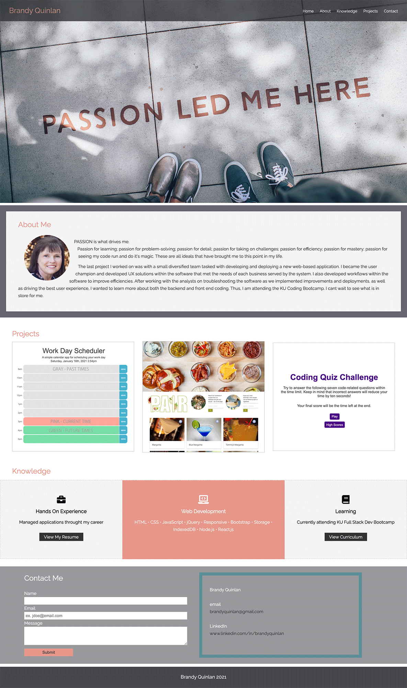

# Portfolio_Update
## Unit 08 Project 1 Homework: Professional Materials

For this homework assignment, I updated my portfolio page and other materials to build toward being employer-competitive.

## Requirements - All Met

* Update Portfolio
* Submit an updated portfolio featuring Project 1 and two exemplary homework assignments.
* Submit an updated GitHub profile with pinned repositories featuring Project 1 and two exemplary assignments.
* Submit an updated resume
* Submit an updated LinkedIn profile

## URL and Repo Locations

The url for the site is: https://brandyquinlan.github.io/brandyquinlan/
The repo is located here: https://github.com/brandyquinlan/brandyquinlan

## Screenshots of Portfolio

